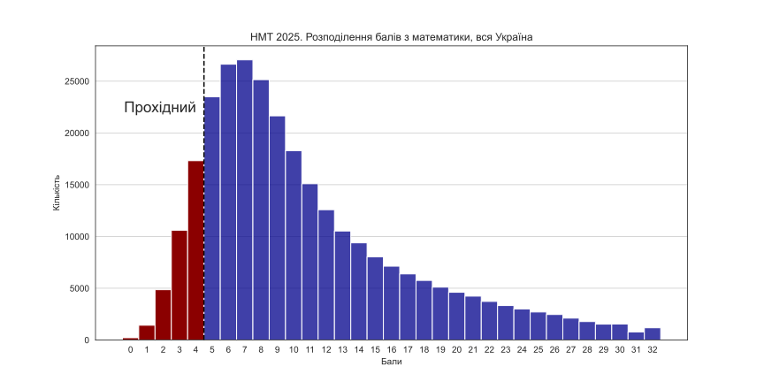
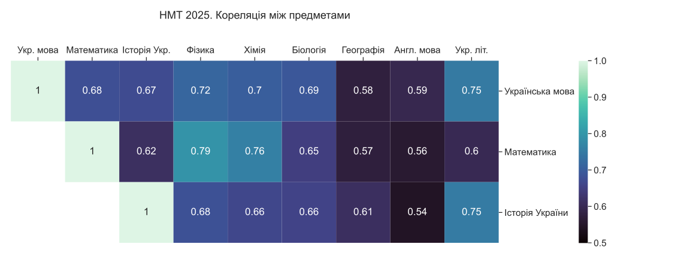

# NMT 2025 in Figures: Exploratory Data Analysis

An exploratory data analysis (EDA) of the 2025 Ukrainian National Multi-Subject Test (NMT). This project investigates performance disparities, subject correlations, and educational stratification among high school graduates using official open data.

## Overview
The goal of this analysis is to uncover the structural characteristics of the 2025 NMT results. By analyzing the raw testing data, this project explores how geography, educational institution type, and subject selection impact overall student performance.

## Data source
The raw data for this analysis was published by the УЦОЯО (Український центр оцінювання якості освіти). 

*   **Dataset Landing Page:** `https://zno.testportal.com.ua/opendata`
*   **Retrieval Date:** 11 september 2025
*   **Format:** CSV (semicolon-separated)

## Key Insights
*   **General score distribution shape:** Math score distribution is highly right-skewed, which indicates that the test was fairly hard for most participants. Other subjects also have similar distributions shape, but with lower skewness.



*   **The Math Ceiling Effect:** The mathematics exam distribution has an unnatural spike at the absolute maximum score (32 points). This indicates a lack of variance required to accurately differentiate between top-tier performers. Also, there are the most number of best-score participants for mathematics, which also confirms the hypothesis.
*   **Correlational matrix:** Mandatory subjects are moderately or strongly positively correlated with each other and with optional subjects. Correlations vary between 0.54 (English and history of Ukraine) and 0.79 (Mathematics and Physics)



*   **Academic stratification:** Participants from specialized schools highly outperforms participants from other educational institutions. Also, students from urban area tends to achive higher scores (the fraction of participants who achieved the highest scores is almost 5 times higher in urban area than rural)

*(Note: See `outputs` directory for the full visual breakdown).*

## Project Structure
```text
nmt2025/
│
├── data/                   # Raw and processed CSV datasets
├── notebooks/              # Jupyter notebooks for execution
│   ├── data_cleaning.ipynb
│   └── visualizations.ipynb
├── outputs/                # Generated SVG visualizations
├── utils/                  # Reusable Python modules
│   └── load_data.py
├── .gitignore              
├── Dockerfile              # Container environment configuration
├── README.md               # Project documentation
└── requirements.txt        # Python dependencies
```

## Tech Stack
*   **Python 3.11**
*   **Pandas & NumPy:** Data cleaning, manipulation, and binning
*   **Seaborn & Matplotlib:** Statistical data visualization
*   **Docker:** Containerized, reproducible execution environment

## How to Run (via Docker)
To ensure full reproducibility, this project is configured to run inside a Docker container with a volume mount.

**Note**: use Bash terminal for the following commands

**1. Clone the repository:**
```bash
git clone https://github.com/MonsieurAI/NMT2025_EDA.git
cd NMT2025_EDA
```

**2. Build the Docker image:**
```bash
docker build -t nmt-analysis .
```

**3. Run the container:**
```bash
docker run -p 8888:8888 --name nmt-container -v "${PWD}:/app" nmt-analysis
```

**4. Access the notebooks:** 
Open the provided `http://127.0.0.1:8888/tree` link in your browser to access and run the notebooks.